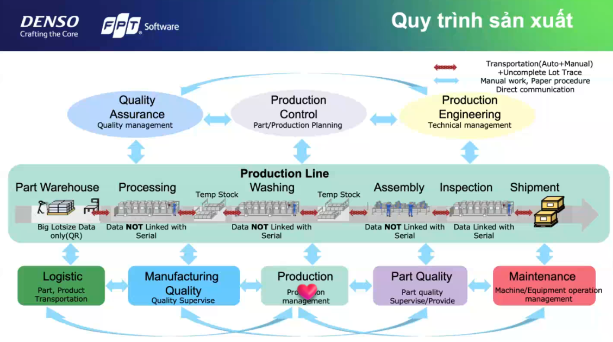

# BA thu thập yêu cầu

## Các bước thực hiện
- Tìm hiểu về ngành và luồng làm việc hiện tại của DENSO
- Chuẩn bị trước khi tham quan
- Thu hoạch khi tham quan nhà máy
- Xác định rõ ràng paintpoint cần nhắm đến
- Xác định các lợi ích mà project có thể cung cấp
- Xác định các tính năng cần có của project

## Tìm hiểu về ngành và luồng làm việc hiện tại của DENSO
### Quy trình sản xuất của DENSO

`Part Warehouse (Kho linh kiện):
`
Đây là nơi lưu trữ các linh kiện và vật liệu trước khi tham gia vào quy trình sản xuất.
Dữ liệu về lô hàng được theo dõi qua QR code (Big Lotsize Data only), nhưng không liên kết với mã serial của sản phẩm.

`Processing (Gia công):
`
Sau khi linh kiện rời khỏi kho, chúng sẽ trải qua quá trình gia công.
Dữ liệu từ giai đoạn này không được liên kết với mã serial của từng sản phẩm. Điều này có thể tạo ra một điểm yếu khi cần truy xuất nguồn gốc sản phẩm tại từng bước.

`Production Line Washing (Dây chuyền rửa sản phẩm):
`
Đây là công đoạn làm sạch các linh kiện sau khi gia công.
Dữ liệu của giai đoạn này cũng không liên kết với serial của sản phẩm.

`Assembly (Lắp ráp):
`
Sau khi làm sạch, linh kiện được lắp ráp thành các bộ phận hoàn chỉnh.
Tương tự như trước đó, dữ liệu của giai đoạn này vẫn chưa được liên kết với mã serial.

`Inspection (Kiểm tra chất lượng):
`
Sản phẩm sau khi lắp ráp sẽ trải qua quá trình kiểm tra để đảm bảo chất lượng.
Dữ liệu từ giai đoạn kiểm tra này đã được liên kết với mã serial, giúp đảm bảo truy xuất nguồn gốc cho từng sản phẩm riêng lẻ.

`Shipment (Xuất hàng):
`
Sản phẩm hoàn thiện sẽ được vận chuyển đến khách hàng hoặc các nhà máy lắp ráp khác.
Tại đây, dữ liệu sản phẩm được liên kết với mã serial, cho phép truy xuất lịch sử và tình trạng sản phẩm từ lúc kiểm tra đến khi xuất xưởng.

`Các phần quản lý khác:
`

`Production Control (Kiểm soát sản xuất):` Đảm bảo việc lập kế hoạch và điều phối sản xuất, bao gồm quản lý các bộ phận và tiến độ sản xuất.

`Quality Assurance (Đảm bảo chất lượng):` Đảm bảo rằng chất lượng của sản phẩm và quy trình được duy trì trong suốt quá trình sản xuất. Bộ phận này đóng vai trò giám sát chung.

`Production Engineering (Kỹ thuật sản xuất)`: Quản lý kỹ thuật để tối ưu hóa và điều phối các quy trình sản xuất một cách kỹ thuật nhất.

`Các thành phần phụ trợ:`
Logistic (Logistics): Đảm bảo vận chuyển các linh kiện và sản phẩm hoàn thiện qua các giai đoạn khác nhau trong quy trình sản xuất.

`Manufacturing Quality (Chất lượng sản xuất)`: Giám sát chất lượng sản xuất để đảm bảo tất cả các sản phẩm đều đáp ứng tiêu chuẩn chất lượng cao.

`Production (Sản xuất)`: Quản lý tổng thể quy trình sản xuất từ nguyên vật liệu đến sản phẩm cuối cùng.

`Part Quality (Chất lượng linh kiện)`: Quản lý chất lượng các bộ phận riêng lẻ, đảm bảo rằng các linh kiện đều đạt chuẩn trước khi lắp ráp.

`Maintenance (Bảo trì)`: Đảm bảo các thiết bị và máy móc được vận hành tốt, giảm thiểu tình trạng hỏng hóc và gián đoạn quy trình sản xuất.

`Điểm cần chú ý (Painpoints tiềm năng)`:
Thiếu liên kết dữ liệu với serial trong nhiều giai đoạn: Việc dữ liệu không liên kết với mã serial trong các giai đoạn như Processing, Washing, và Assembly có thể gây khó khăn trong việc truy xuất nguồn gốc sản phẩm. Điều này có thể tạo ra khó khăn trong việc xác định lỗi khi có vấn đề xảy ra, và là một cơ hội để bạn ứng dụng IoT hoặc công nghệ dữ liệu nhằm cải thiện việc theo dõi.

Quản lý vận chuyển thủ công: Mô hình cho thấy sự kết hợp giữa vận chuyển tự động và thủ công, có thể gây chậm trễ hoặc mất tính đồng bộ trong quy trình sản xuất. Đây có thể là một điểm để cải thiện thông qua việc tự động hóa nhiều hơn.

### Xu hướng công nghệ trong ngành

## Chuẩn bị trước khi tham quan
### Liệt kê các painpoint có thể có 
### Giải pháp dự kiến đề xuất
### Chuẩn bị các câu hỏi
`Về quy trình sản xuất và quản lý`
1. Dữ liệu sản xuất hiện tại có được tự động hóa hoàn toàn không, hay có giai đoạn nào vẫn phải nhập liệu thủ công?
2. Quy trình nào trong sản xuất thường xuyên gặp sự cố hoặc có nguy cơ làm chậm tiến độ sản xuất?
3. Làm thế nào để truy xuất nguồn gốc của sản phẩm khi một lỗi phát sinh, đặc biệt khi dữ liệu không liên kết với mã serial trong các giai đoạn như Processing hay Assembly?
4. Hiện tại, có giải pháp nào được áp dụng để theo dõi và tối ưu hóa hiệu suất máy móc theo thời gian thực không?
   
`Về hệ thống kiểm soát chất lượng`

5. Việc đảm bảo chất lượng linh kiện từ các nhà cung cấp bên ngoài như thế nào? Có thách thức gì khi kiểm soát chất lượng từ những nguồn này?
6. Bộ phận đảm bảo chất lượng có gặp khó khăn gì trong việc theo dõi và duy trì tiêu chuẩn chất lượng tại từng giai đoạn không?
   
`Về dữ liệu và IoT`

7. Có hệ thống nào đang được áp dụng để thu thập và phân tích dữ liệu sản xuất không? Những khó khăn nào gặp phải trong việc thu thập dữ liệu chính xác từ các dây chuyền?
8. Các cảm biến IoT hiện nay được sử dụng như thế nào trong quy trình sản xuất? Những khu vực nào cần được nâng cấp hoặc bổ sung thêm cảm biến để theo dõi tốt hơn?
9. Có thách thức nào trong việc tích hợp dữ liệu từ các thiết bị khác nhau (cảm biến, máy móc, phần mềm quản lý)?

`Về vấn đề logistics và kho`

10. Có khó khăn nào trong việc quản lý hàng tồn kho và dự trữ linh kiện? Những sai sót nào thường xảy ra trong quá trình vận chuyển giữa các khu vực trong nhà máy?
11. Các bước vận chuyển giữa kho và các khu vực sản xuất có hoàn toàn tự động không, hay vẫn có sự tham gia của lao động thủ công?
    
`Về bảo trì và bảo dưỡng`

12. Các thiết bị, máy móc thường được bảo trì theo chu kỳ nào? Có sử dụng công nghệ để theo dõi tình trạng máy móc theo thời gian thực không?
13. Những sự cố về máy móc nào xảy ra thường xuyên và gây ảnh hưởng đến tiến độ sản xuất?
14. Việc bảo trì máy móc có phải thực hiện thủ công, hay có hệ thống nào tự động phát hiện và thông báo khi có sự cố xảy ra?
    
`Về quản lý và giám sát sản xuất`

15. Các hệ thống giám sát sản xuất hiện tại có đáp ứng đủ nhu cầu theo dõi tiến độ sản xuất và phân tích hiệu suất không?
16. Có những bước nào trong quy trình giám sát sản xuất hiện tại cần cải tiến hoặc tự động hóa hơn?
    
`Về kế hoạch cải tiến`

17. Nhà máy có kế hoạch áp dụng thêm các công nghệ mới như AI, machine learning, hay IoT để cải thiện hiệu suất và chất lượng sản xuất không?
18. Trong tương lai, nhà máy có kế hoạch nào để liên kết dữ liệu giữa các giai đoạn sản xuất nhằm theo dõi chính xác hơn không?
    
`Về an toàn và hiệu quả vận hành`

19. Có các vấn đề nào về an toàn lao động trong các giai đoạn sản xuất mà nhà máy đang tìm giải pháp cải thiện không?
    
20. Có những thách thức gì trong việc tối ưu hóa mức tiêu thụ năng lượng và tài nguyên trong quá trình sản xuất?

## Thu hoạch khi tham quan nhà máy
### Liệt kê các painpoint thực tế
Các painpoint thực tế có thể nhìn thấy:

1. Các máy trong nhà máy đang hoạt động độc lập, tất cả các hoạt động monitor là do con người, đội vô địch năm ngoái nhìn ra điều này và làm 1 AI chụp ảnh đồng hồ rồi tập hợp số liệu, tuy vậy cảm giác vẫn không ổn với các máy không có đồng hồ, liệu có thể số hóa máy móc không?
2. Độ sạch của linh kiện chưa được quản lý, chỉ có thể quản lý được độ sạch của nhà máy
3. Về phần bảo trì máy móc, khi xảy ra bất thường, các thợ bảo trì vẫn phải đến tận nơi để bảo trì máy móc, dù là các lỗi rất nhỏ
4. (PAINPOINT của tổng giám đốc) Nhà máy là nhà máy làm theo order của khách hàng, trong tình trạng thế giới bất thường hiện nay, có cách nào để dự đoán được số order tiếp theo hay không :)))) 
### Câu trả lời cho các câu hỏi đã chuẩn bị
`Về quy trình sản xuất và quản lý`
1. Dữ liệu sản xuất hiện tại có được tự động hóa hoàn toàn không, hay có giai đoạn nào vẫn phải nhập liệu thủ công?
- Có quy trình đã được nhập liệu, nhưng có quy trình vẫn là thủ công 

2. Quy trình nào trong sản xuất thường xuyên gặp sự cố hoặc có nguy cơ làm chậm tiến độ sản xuất?
- Chưa hỏi được 

1. Làm thế nào để truy xuất nguồn gốc của sản phẩm khi một lỗi phát sinh, đặc biệt khi dữ liệu không liên kết với mã serial trong các giai đoạn như Processing hay Assembly?
- Chưa hỏi được 

2. Hiện tại, có giải pháp nào được áp dụng để theo dõi và tối ưu hóa hiệu suất máy móc theo thời gian thực không?
- Không có
   
`Về hệ thống kiểm soát chất lượng`

1. Việc đảm bảo chất lượng linh kiện từ các nhà cung cấp bên ngoài như thế nào? Có thách thức gì khi kiểm soát chất lượng từ những nguồn này?
- Đã có giải pháp: Công ty ưu tiên sử dụng linh kiện nhật, những linh kiện khác công ty sẽ có 1 khu để test các linh kiện, máy móc đó
1. Bộ phận đảm bảo chất lượng có gặp khó khăn gì trong việc theo dõi và duy trì tiêu chuẩn chất lượng tại từng giai đoạn không?
- Chưa hỏi được 
   
`Về dữ liệu và IoT`

1. Có hệ thống nào đang được áp dụng để thu thập và phân tích dữ liệu sản xuất không? Những khó khăn nào gặp phải trong việc thu thập dữ liệu chính xác từ các dây chuyền?
- Chưa hỏi được
2. Các cảm biến IoT hiện nay được sử dụng như thế nào trong quy trình sản xuất? Những khu vực nào cần được nâng cấp hoặc bổ sung thêm cảm biến để theo dõi tốt hơn?
- Chưa hỏi được
3. Có thách thức nào trong việc tích hợp dữ liệu từ các thiết bị khác nhau (cảm biến, máy móc, phần mềm quản lý)?
- Chưa hỏi được 
  
`Về vấn đề logistics và kho`

1.  Có khó khăn nào trong việc quản lý hàng tồn kho và dự trữ linh kiện? Những sai sót nào thường xảy ra trong quá trình vận chuyển giữa các khu vực trong nhà máy?
- Chưa hỏi được 
2.  Các bước vận chuyển giữa kho và các khu vực sản xuất có hoàn toàn tự động không, hay vẫn có sự tham gia của lao động thủ công?
- Hiện tại đang hoàn toàn tự động 

`Về bảo trì và bảo dưỡng`

1.  Các thiết bị, máy móc thường được bảo trì theo chu kỳ nào? Có sử dụng công nghệ để theo dõi tình trạng máy móc theo thời gian thực không?
- Khi xảy ra bất thường thì sẽ bảo trì, chưa có công nghệ để theo dõi tình trạng máy móc thời gian thực 
1.  Những sự cố về máy móc nào xảy ra thường xuyên và gây ảnh hưởng đến tiến độ sản xuất?
- Chưa hỏi được 
1.  Việc bảo trì máy móc có phải thực hiện thủ công, hay có hệ thống nào tự động phát hiện và thông báo khi có sự cố xảy ra?
- Thủ công, khi xuất hiện bất thường, sẽ có người đến ktra và ping đội bảo trì 
    
`Về quản lý và giám sát sản xuất`

1.  Các hệ thống giám sát sản xuất hiện tại có đáp ứng đủ nhu cầu theo dõi tiến độ sản xuất và phân tích hiệu suất không?
- Có
2.  Có những bước nào trong quy trình giám sát sản xuất hiện tại cần cải tiến hoặc tự động hóa hơn?
- Cỏ vẻ không cần
`Về kế hoạch cải tiến`

17. Nhà máy có kế hoạch áp dụng thêm các công nghệ mới như AI, machine learning, hay IoT để cải thiện hiệu suất và chất lượng sản xuất không?
- CÓ
19. Trong tương lai, nhà máy có kế hoạch nào để liên kết dữ liệu giữa các giai đoạn sản xuất nhằm theo dõi chính xác hơn không?
- CÓ
`Về an toàn và hiệu quả vận hành`

19. Có các vấn đề nào về an toàn lao động trong các giai đoạn sản xuất mà nhà máy đang tìm giải pháp cải thiện không?
- Chưa hỏi và không định hỏi 
    
20. Có những thách thức gì trong việc tối ưu hóa mức tiêu thụ năng lượng và tài nguyên trong quá trình sản xuất?
- Chưa hỏi và không định hỏi 

## Xác định rõ ràng painpoint cần nhắm đến

## Xác định các lợi ích mà project có thể cung cấp

## Xác định các tính năng cần có của project
